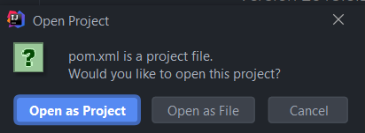

# Mutants Application
Mutants application evaluate a dna sequence and verify mutant or human dna, also generate stats.

### Install
    
Clone the project 

    git clone https://github.com/DavidPalacios7/mutantsproject.git

Open the project with your IDE

### Usage

    The application generate the endpoints:
    
    GET localhost:8080/stats
    stats endpoint generate the human and mutant dna secuences evaluated for the /mutants endpoint and the ratio 
    
    POST localhost:8080/mutants
    mutants endpoint evaluate an array of strings (dna sequence) and determine if that sequence is from a mutant or not,
    
    The mutant dna have more than 2 sequences of letters (A,T,C,G) compose for at least four characters. you can see 
    an example in the image.
    
   
    
    All strings should have the same length, that lengh must be equals to array length. 
    Examples:
    {"dna":["QQQQ","QQQQ","QQQQ","QQQQ"]}
    
    {"dna":["AAAA","AAAA","AAAA","AAAA"]}

    {"dna":["TTTT","TTTT","TTTT","TTTT"]}

    {"dna":["SQWS","AWER","AZXS","HFED"]}

#### Testing

    mvn clean test